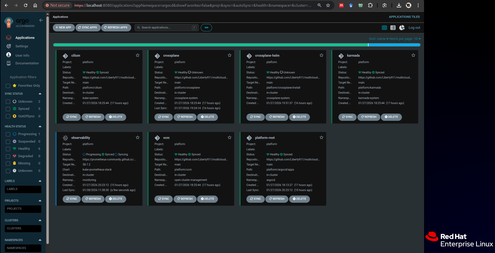

# Multicloud Kubernetes Platform (GitOps)

A production-style Kubernetes platform engineering project built using ArgoCD GitOps, designed to demonstrate real-world cluster lifecycle, observability, and multicloud orchestration patterns.

 Platform Overview

This project implements a GitOps-driven Kubernetes platform with the following capabilities:

Declarative infrastructure management

Automated application synchronization

Observability with persistence

Multi-cluster orchestration foundations

Clean separation of CRDs and workloads

Production-grade folder structure

All components are managed entirely via ArgoCD App-of-Apps.

# ArgoCD GitOps View

The platform is fully managed using the App-of-Apps pattern.
All components are continuously reconciled from GitHub.

# Structure of Platform Architecture

GitHub (source of truth)
        ↓
   ArgoCD (root app)
        ↓
   App-of-Apps Pattern
        ↓
+-----------------------------+
| Platform Components         |
|                             |
| • Cilium (CNI)              |
| • Crossplane                |
| • Ingress-NGINX             |
| • Prometheus Operator CRDs  |
| • Prometheus + Grafana      |
| • Karmada                   |
| • Open Cluster Management   |
+-----------------------------+

# Platform Architecture

This repository helps to demonstrates a production-style Kubernetes platform
built using GitOps, ArgoCD App-of-Apps, Crossplane, and multi-cluster
management tooling.

 
 Deployed Components

# Networking

-Cilium CNI

    -eBPF-based networking

    -Cluster-level networking foundation

# GitOps

-ArgoCD

    -App-of-Apps pattern

    -Automated sync, prune, self-heal

# Infrastructure Orchestration

-Crossplane

    -AWS providers

    -Infrastructure as Kubernetes resources

    -ProviderConfig with external credentials

# Observability

-Prometheus Operator (CRDs managed separately)

-kube-prometheus-stack

-Grafana

    -Persistent storage (PVC)

    -Ingress-enabled access

    -GitOps-managed values

# Traffic Management

-Ingress-NGINX

-Platform-wide ingress controller

# Multi-cluster Foundations

-Karmada

-Open Cluster Management (OCM)

Main Decision of The CloudTech

-CRD → Chart Ordering

To avoid ArgoCD sync instability:

-Prometheus Operator CRDs are installed before

-kube-prometheus-stack Helm chart

This is what helps eliminates:

-Sync flapping

-CRD race conditions

-resource mapping not found errors

# ArgoCD UI

All platform components appear as individual applications managed by a single root app.

# Emphasis of This Project

-Kubernetes platform design

-GitOps operational maturity

-Helm + Kustomize integration

-CRD lifecycle management

-Observability engineering

-Multi-cluster readiness

-Clean repo hygiene

# The target scope of this project:

This project is designed for:

-Platform Engineer roles

-DevOps Engineer roles

-Site Reliability Engineer roles

-Cloud Infrastructure Engineer roles

